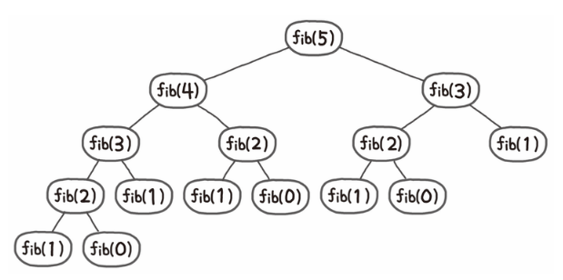
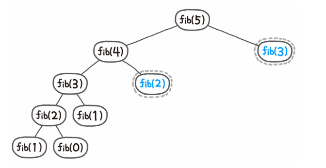

# Memoization

- **동일한 계산을 반복하는데 계산한 결과를 메모해두는 개념**

재귀함수에서 재귀함수 계산 값을 메모리에 저장 후 다시 사용하는 방법 ⇒ `중복 계산 방지` , 계산에 소요되는 시간 줄이는 방법

`Dynamic Programming` 의 **핵심**이 되는 기술

- **피보나치 수열**



왼쪽에서 미리 계산한 fib(2) , fib(3) 을 `메모리`에 저장시켜놓고 다시 해당 함수를 사용할 때 중복계산하지 않고 바로 값을 사용하는 것



- 자바 코드로 구현한 피보나치 ⇒ 중복 계산 실행

```java
public class fibonacci {
 
    public static int fibonacci(int n) {
        if (n <= 1)
            return n;
        else
            return fibonacci(n - 2) + fibonacci(n - 1);
    }
 
    public static void main(String[] args) {
        System.out.println(fibonacci(10));
    }
 
}
```

- 메모이제이션으로 만든 피보나치 수열

```java
public class Memoization_Fibonacci {
 
    static long[] memo;
    public static long fibonacci(int n) {
        if (n <= 1)
            return n;
        else if (memo[n] != 0)
            return memo[n];
        else
            return memo[n] = fibonacci(n - 1) + fibonacci(n - 2);
 
    }
    
    public static void main(String[] args) {
        memo = new long[101];
        System.out.println(fibonacci(100));
    }
}
```

-  Top-Down 방식으로 사용할 수도 있고 Bottom-Up 방식으로도 사용가능하다.