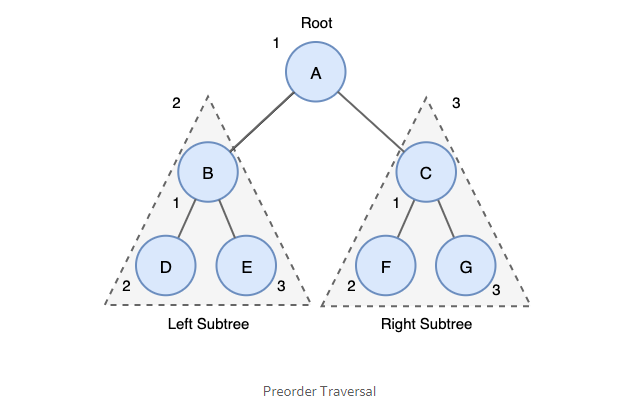
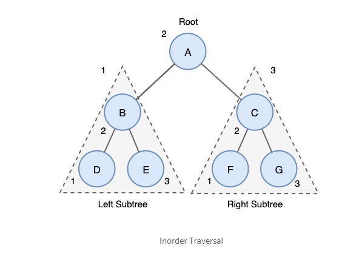
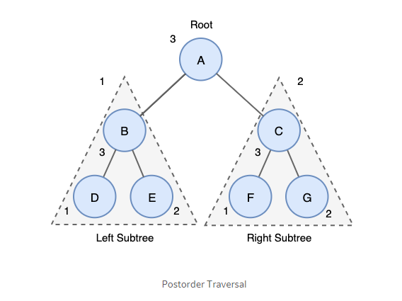

# Tree Traversal

### 트리 순회 ( Tree Traversal )

트르이 모든 노드들을 방문하는 과정

선형 자료구죠 ( 연결 리스트 , 스택 , 큐 등 ) → 순차적으로 요소 접근하지만 트리 자료구조는 다른 방식 사용

### 트리 순회 방법

### 전회 순회 ( Preorder )

- `깊이 우선 순회 ( DFT Depth First Traversal )`
- 트리 복사 혹은 전위 표기법을 구하는데 주요 사용
    - 트리 복사 → 자식노드보다 부모가 먼저 생성되어야 하기 때문에
- 방법
    1. Root 노드 방문
    2. 왼쪽 서브트리부터 전위순회
    3. 오른쪽 서브트리 전위 순회

### 중위 순회 ( Inorder Traversal )

- 왼쪽 → 오른쪽 대칭순서로 순회 ⇒ 대칭순회(symmentic traversal)라고도 함
- 중위순회는 이진 탐색 트리(BST)에서 오름차순 또는 내림차순으로 값을 가져올 때 사용
- 내림차순일 때는 ( 오른쪽 → root → 왼쪽 )

### 후위 순회 ( Postorder Traversal )

- 트리삭제에 주로 사용 ⇒ 부모삭제 전 자식 노드 삭제하는 순으로 노드를 삭제해야하기 때문
- 방법
    1. 왼쪽 서브 트리를 후위 순회
    2. 오른쪽 서브트리를 후위 순회
    3. Root 접근

